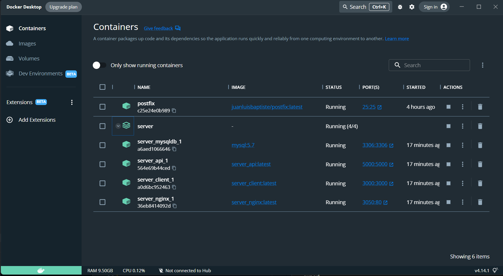
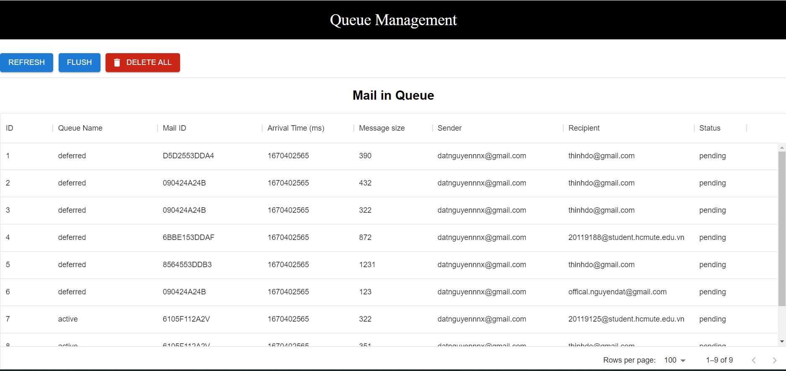
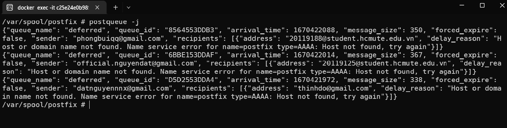
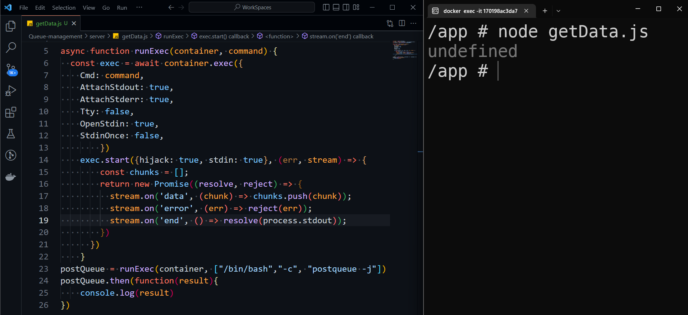

## Queue Management
### Required
  - Docker - Latest version 
### Feature
#### Release 1.0.0
  - [x] **Dockerize project with Reactjs, Nodejs, Nginx, MySQL.**
  - [x] **Rendering the "sample JSON" UI.**
  - [ ] **Capture the output result when executed command from Backend to Postfix container.** 
  - [ ] **Input command for Flush queue, Delete message on queue, Hold/Unhold message, Deliver immediately when interact UI.**
  - [ ] **Storing data on database.**
### Overview project
<p align="center"></p>
### Installation
**Docker Compose**
```
$ git clone https://github.com/datnguyennnx/Queue-management
$ cd Queue-management
$ yarn run docker:build 
$ yarn run docker:up 
```
**Docker container Postfix**
```
$ cd Queue-management/postfix
$ docker build -t juanluisbaptiste/postfix .
$ docker run -d --name postfix -p "25:25" -e SMTP_SERVER=postfix -e SMTP_USERNAME=admin@gmail.com -e SMTP_PASSWORD=root -e SERVER_HOSTNAME=postfix.com juanluisbaptiste/postfix
```
When run `yarn run docker:up` we following in `Docker Desktop`.
<p align="center"></p>

Open http://localhost:3000 to view it in your browser. We rendering the sample JSON following direct `"client/src/modules/datagrid/Data.json"`.
<p align="center"></p>

### Troubling
Assume `Nodejs` can record the command's output result. When sending JSON from the backend to the client, we can use `Axios`. The JSON format when `Postfix container` exported. 
<p align="center"></p>

However we can't capture the output command for some reason. To obtain the ID of the `Postfix container` and enter the command to communicate with the `Postfix container`, we utilize the `Dockerode` library. **Issue here, when the command is executed, data is not captured. Data can't store to variable so that we can't send JSON to client.**
<p align="center"></p>

### License 
##### GPL-3.0 license. See [LICENSE](https://github.com/datnguyennnx/Queue-management/blob/main/LICENSE) for the full license text.