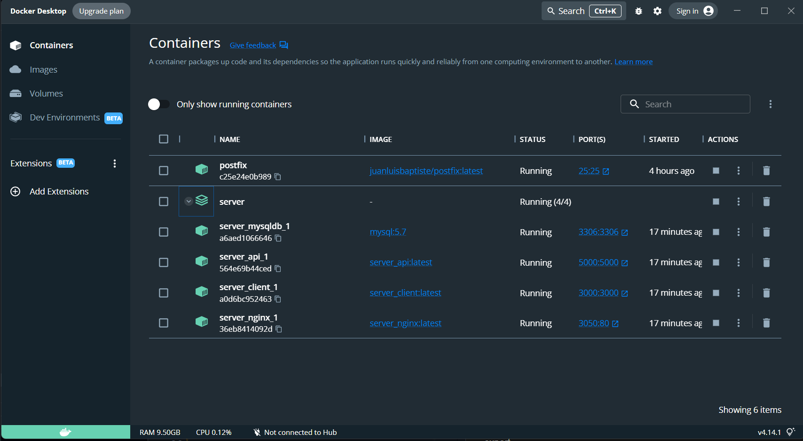

### Issue dockerode 
`getData.js : `
```js
var Docker = require('dockerode')
var docker = new Docker({socketPath: '/var/run/docker.sock'})
var container = docker.getContainer('c25e24e0b989')
```
Get id container `Postfix` from `Docker Desktop`. Then create function for run executed command using `Dockerode` after that function return object JSON for capture result of command. Using `Axios` for send object JSON to client. 
<p align="center"></p>